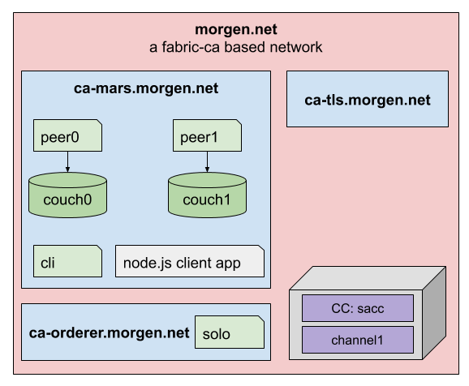

# The morgen.net network


In this scenario we are going to setup a fabric network from scratch. You can find the network topology in the diagram above.

Starting from a single organization we need two more organizations. One for the Ordering-Service and another for the TLS-Service.

To create the crypto artifacts we use fabric-ca. So every organization starts with his own certificate authority (CA).

A central TLS Service is established to provide the TLS certificates for the whole network members.

## Network configuration
In order to be able to address the network members correctly by it`s name and to avoid some common TLS problems we can make some dns entries in the servers hosts file.

```bash
# edit local hosts file
vi /etc/hosts

# add the following domains
127.0.0.1 ca-tls.morgen.net
127.0.0.1 ca-orderer.morgen.net
127.0.0.1 ca-mars.morgen.net
127.0.0.1 peer0.mars.morgen.net
127.0.0.1 peer1.mars.morgen.net
127.0.0.1 orderer.morgen.net
```

## Create the root folder
First, we start with a short project setup. Based on our fabric installation set up, we switch to the fabric folder as our starting point.
```bash
# we create the base folder 
cd /$USER/fabric/
mkdir morgen.net
cd morgen.net
```

## Create the project structure
Derived from our network topology we create the following directory structure.

```bash
mkdir ca-tls.morgen.at
mkdir ca-orderer.morgen.at
mkdir ca-mars.morgen.at
```
As you can see we create a root folder for every organization. You can check the structure.
```bash
tree .
.
├── ca-mars.morgen.at
├── ca-orderer.morgen.at
└── ca-tls.morgen.at
```

We need a node.js client application as well to interact with the network. For this we create a folder called app. We will come back later to this folder.
```bash
mkdir app
```
In this scenario we need a simple chaincode. For this we can use the **sacc**''** chaincode from the fabric-samples. 

```bash
mkdir chaincode
cp -r ../fabric-samples/chaincode/sacc/ ./
```
The final folder structure should look like this.
```bash
tree .
.
├── app
├── ca-mars.morgen.net
├── ca-orderer.morgen.net
├── ca-tls.morgen.net
├── chaincode
└── sacc
    └── sacc.go
```

Now we are ready to set up each organization step by step. We will do that in the following order.

1. [ca-tls.morgen.net](./ca-tls.morgen.net/index.md)
2. [ca-orderer.morgen.net](./ca-orderer.morgen.net/index.md)
3. [ca-mars.morgen.net](./ca-mars.morgen.net/index.md)
4. [start the network](./index2.md)

## How to reset the network
1. [Instructions to clear the network](./clearSetup.md)


