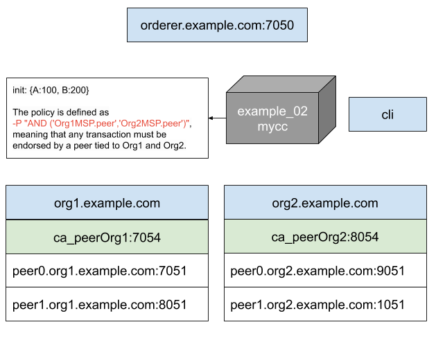

# First try - Build Your First Network (BYFN)

The build your first network (BYFN) scenario provisions a sample Hyperledger Fabric network consisting of two organizations, each maintaining two peer nodes. It also will deploy a “Solo” ordering service by default, though other ordering service implementations are available.

```bash
Usage:
byfn.sh <mode>  [-c <channel name>] [-t <timeout>] [-d <delay>] [-f <docker-compose-file>] 
                [-s <dbtype>] [-l <language>] [-o <consensus-type>] [-i <imagetag>] [-v]
  <mode> - one of 'up', 'down', 'restart', 'generate' or 'upgrade'
    - 'up' - bring up the network with docker-compose up
    - 'down' - clear the network with docker-compose down
    - 'restart' - restart the network
    - 'generate' - generate required certificates and genesis block
    - 'upgrade'  - upgrade the network from version 1.3.x to 1.4.0
  -c <channel name> - channel name to use (defaults to \"mychannel\")
  -t <timeout> - CLI timeout duration in seconds (defaults to 10)
  -d <delay> - delay duration in seconds (defaults to 3)
  -f <docker-compose-file> - specify which docker-compose file use 
      (defaults to docker-compose-cli.yaml)
  -s <dbtype> - the database backend to use: goleveldb (default) or couchdb
  -l <language> - the chaincode language: golang (default), node, or java
  -o <consensus-type> - the consensus-type of the ordering service: solo (default), 
      kafka, or etcdraft
  -i <imagetag> - the tag to be used to launch the network (defaults to \"latest\")
  -v - verbose mode
byfn.sh -h (print this message)

Typically, one would first generate the required certificates and
genesis block, then bring up the network. e.g.:

  byfn.sh generate -c mychannel
  byfn.sh up -c mychannel -s couchdb
  byfn.sh up -c mychannel -s couchdb -i 1.4.0
  byfn.sh up -l node
  byfn.sh down -c mychannel
  byfn.sh upgrade -c mychannel

Taking all defaults:
      byfn.sh generate
      byfn.sh up
      byfn.sh down
```

## Start a basic network configuration
```bash
cd $HOME/fabric

# create a new tmux session with 2 panels
tmux new -s fabric
CTRL + b “

# switch to the first panel
CTRL + q 0

# switch into the source directory
cd fabric-samples/first-network

# generate network artifacts
./byfn.sh generate -c channel1

# bring up the network with channel 1
./byfn.sh up -c channel1

# bring up the network with channel 1 and couchdb
./byfn.sh up -c channel1 -s couchdb

# show if some containers are running
docker ps

# play with docker ps --format
docker ps --format '{{.ID}}\t {{.Names}}\t\t {{.Ports}}'

# leave tmux session
CTRL + b d 

# bring down the network
./byfn.sh down

```
The result is a network that consists of the following components and can be represented graphically as follows.



## Query the Ledger

```bash
# switch to the target panel
CTRL + b q 1

# jump into the cli container
docker exec -it cli bash

# do you first blockchain query
export CHANNEL_NAME=channel1
peer chaincode query -C $CHANNEL_NAME -n mycc -c '{"Args":["query","a"]}'
```

```bash
# get some information about your current situation
printenv | grep CORE

# we will see the following environment vars
CORE_PEER_LOCALMSPID=Org1MSP
CORE_PEER_ADDRESS=peer0.org1.example.com:7051
CORE_PEER_ID=cli

CORE_PEER_TLS_ENABLED=true
CORE_PEER_TLS_KEY_FILE=/opt/../peer/crypto/peerOrganizations/org1.example.com/peers/peer0.org1.example.com/tls/server.key
CORE_PEER_TLS_CERT_FILE=/opt/../peer/crypto/peerOrganizations/org1.example.com/peers/peer0.org1.example.com/tls/server.crt
CORE_PEER_TLS_ROOTCERT_FILE=/opt/../peer/crypto/peerOrganizations/org1.example.com/peers/peer0.org1.example.com/tls/ca.crt

CORE_PEER_MSPCONFIGPATH=/opt/../peer/crypto/peerOrganizations/org1.example.com/users/Admin@org1.example.com/msp

CORE_VM_ENDPOINT=unix:///host/var/run/docker.sock

``` 
## How do I see these transactions?

```bash 
# we switch to panel 0
CTRL + b q 0

# we start the logging for the chaincode container
docker logs -f dev-peer0.org1.example.com-mycc-1.0
Aval = 90, Bval = 210

# we start the logging for the chaincode container
docker logs -f dev-peer0.org2.example.com-mycc-1.0
```

## Invoke the ledger

```bash
# we set some environment vars as placeholders to reduce the cli command
export TEST_CHANNEL_NAME=channel1 

export TEST_CA_FILE=/opt/gopath/src/github.com/hyperledger/fabric/peer/crypto/ordererOrganizations/example.com/orderers/orderer.example.com/msp/tlscacerts/tlsca.example.com-cert.pem

export TEST_TLS_ROOT_CERT_ORG1=/opt/gopath/src/github.com/hyperledger/fabric/peer/crypto/peerOrganizations/org1.example.com/peers/peer0.org1.example.com/tls/ca.crt

export TEST_TLS_ROOT_CERT_ORG2=/opt/gopath/src/github.com/hyperledger/fabric/peer/crypto/peerOrganizations/org2.example.com/peers/peer0.org2.example.com/tls/ca.crt


# we set some environment vars as placeholders to reduce the cli command
printenv | grep TEST

peer chaincode invoke -o orderer.example.com:7050 --tls true --cafile $TEST_CA_FILE -C $TEST_CHANNEL_NAME -n mycc --peerAddresses peer0.org1.example.com:7051 --tlsRootCertFiles $TEST_TLS_ROOT_CERT_ORG1 --peerAddresses peer0.org2.example.com:9051 --tlsRootCertFiles $TEST_TLS_ROOT_CERT_ORG2 -c '{"Args":["invoke","a","b","10"]}'
```


## Change the cli view to query Org2

```bash 
# switch to peer0.org2.example.com 
docker exec cli -it bash

# we have to change the following env vars from the cli container
CORE_PEER_LOCALMSPID=Org2MSP
CORE_PEER_ADDRESS=peer0.org2.example.com:9051

CORE_PEER_TLS_KEY_FILE=/opt/gopath/src/github.com/hyperledger/fabric/peer/crypto/peerOrganizations/org2.example.com/peers/peer0.org2.example.com/tls/server.key

CORE_PEER_TLS_CERT_FILE=/opt/gopath/src/github.com/hyperledger/fabric/peer/crypto/peerOrganizations/org2.example.com/peers/peer0.org2.example.com/tls/server.crt

CORE_PEER_MSPCONFIGPATH=/opt/gopath/src/github.com/hyperledger/fabric/peer/crypto/peerOrganizations/org2.example.com/users/Admin@org2.example.com/msp

CORE_PEER_TLS_ROOTCERT_FILE=/opt/gopath/src/github.com/hyperledger/fabric/peer/crypto/peerOrganizations/org2.example.com/peers/peer0.org2.example.com/tls/ca.crt

# check your settings
printenv | grep CORE

# now we can query the Org2 ledger on peer0.org2.example.com
peer chaincode query -C $TEST_CHANNEL_NAME -n mycc -c '{"Args":["query","a"]}'
```


