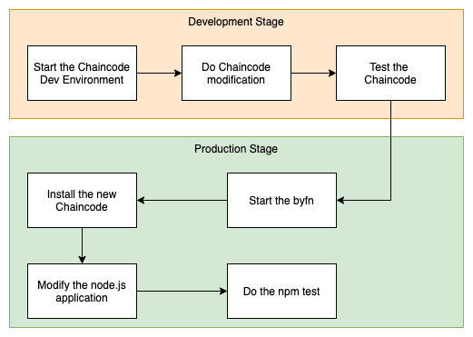
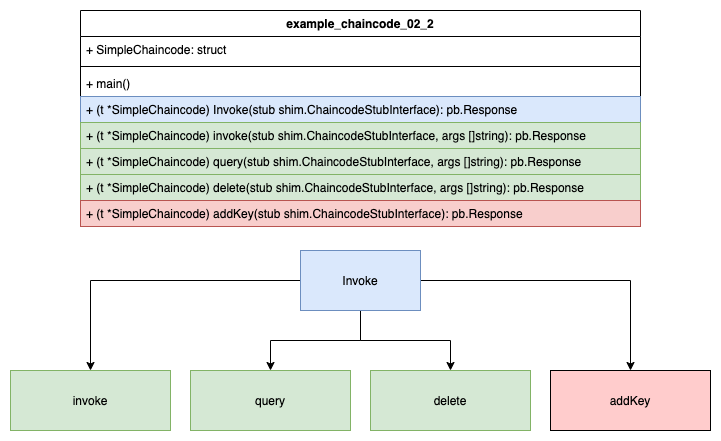

# Modify the chaincode ex02

In this example we are going to modify the existing chaincode: chaincode_example_02. The goal of this example is as follows: 

- Add a missing functionality, namely the addition of new assets.
- Ajust the suitable node.js application

Below you can see the flow diagram what we have to do.


Below you can see a schematic representation of the chaincode.



## Start the Chaincode Dev Environment

To start the dev network we are going to use tmux as a terminal multiplexer. First we create a new tmux session.
```bash
tmux new -s chaincode
```

### Panel 1 - Start the Dev Network

#### Start the environment 
Switch to panel 0. Make sure you are into the directory fabric-samples/chaincode-dev-docker.

```bash 
CTRL + b q 0

# start the network
docker-compose -f docker-compose-simple.yaml up
```

### Panel 2 - Build the Chaincode

Before we can build our new chaincode we have to do the modification on the chaincode. To do so we switch to the VS Studio Code IDE.

#### Modify the chaincode

Copy the target chaincode chaincode_example_02 in a new folder according to your docker-compose-simple.yaml file settings. We do that in a way to edit and build it.

```bash
chaincode:
    container_name: chaincode
    image: hyperledger/fabric-ccenv
    tty: true
    environment:
      - GOPATH=/opt/gopath
      - CORE_VM_ENDPOINT=unix:///host/var/run/docker.sock
      - FABRIC_LOGGING_SPEC=DEBUG
      - CORE_PEER_ID=example02
      - CORE_PEER_ADDRESS=peer:7051
      - CORE_PEER_LOCALMSPID=DEFAULT
      - CORE_PEER_MSPCONFIGPATH=/etc/hyperledger/msp
    working_dir: /opt/gopath/src/chaincode
    command: /bin/sh -c 'sleep 6000000'
    volumes:
        - /var/run/:/host/var/run/
        - ./msp:/etc/hyperledger/msp
        - /root/fabric/hsc-chaincode:/opt/gopath/src/chaincode
    depends_on:
      - orderer
      - peer
```
Watch out for the mounted volumne: /root/fabric/hsc-chaincode:/opt/gopath/src/chaincode. Copy the file to the target folder.

```bash
# where we are
pwd
/root/fabric/fabric-samples/chaincode-docker-devmode

# copy the chaincode into the mounted folder
cp -r ../chaincode/chaincode_example_02/go/ /root/fabric/hsc-chaincode
```
Start modify the chaincode. At the Invoke function we add the following else if block to introduce the new function:
```bash
else if function == "addKey" {
  // add a new key (Asset)
  return t.addKey(stub, args)
}
```

At the end of the file we add the following new function:
```bash 
// add a new key (asset)
func (t *SimpleChaincode) addKey
  (stub shim.ChaincodeStubInterface, args []string) pb.Response {
	// representing new asset
	var Key string

	// representing the value of a new asset
	var Keyval int

	// representing an error
	var err error

	// we need two params a key(Asset) and a value
	if len(args) != 2 {
		return shim.Error("Incorrect number of arguments. Expecting 1")
	}

	// read the key
	Key = args[0]

	// read the value
	Keyval, err = strconv.Atoi(args[1])

	// Write the state back to the ledger
	err = stub.PutState(Key, []byte(strconv.Itoa(Keyval)))
	if err != nil {
		return shim.Error(err.Error())
	}
	return shim.Success(nil)
}
```

Now we are ready to build and test our modified chaincode.

```bash 
# Switch to the second region with the command.
CTRL + b q 1 

# switch into the chaincode container
docker exec -it chaincode bash

# switch into the chaincode folder
cd go02

# build the chaincode
go build

# check the result
# you should see the go binary file.
ls -l

# now you can run the chaincode
CORE_PEER_ADDRESS=peer:7052 CORE_CHAINCODE_ID_NAME=mycc:0 ./go02

```

### Panel 3 - Operate the Chaincode
```bash 

docker exec -it cli bash
cd /opt/gopath

# install the chaincode
peer chaincode install -p chaincodedev/chaincode/go02 -n mycc -v 0

# instantiale the chaincode
peer chaincode instantiate -n mycc -v 0 -c '{"Args":["init","a","100","b","100"]}' -C myc

# check the chaincode
peer chaincode query -n mycc -c '{"Args":["query","a"]}' -C myc

# delete one asset
peer chaincode invoke -n mycc -c '{"Args":["delete","a"]}' -C myc

# check the chaincode again
peer chaincode query -n mycc -c '{"Args":["query","a"]}' -C myc

# add a new asset
peer chaincode invoke -n mycc -c '{"Args":["addKey","c","1000"]}' -C myc

# check the new asset
peer chaincode query -n mycc -c '{"Args":["query","c"]}' -C myc

# transfer from c to b
peer chaincode invoke -n mycc -c '{"Args":["invoke","c","b","500"]}' -C myc
``` 

## Use the new Chaincode with byfn script

- [How to run byfn as testing network](./byfnOwnChaincode.md)


